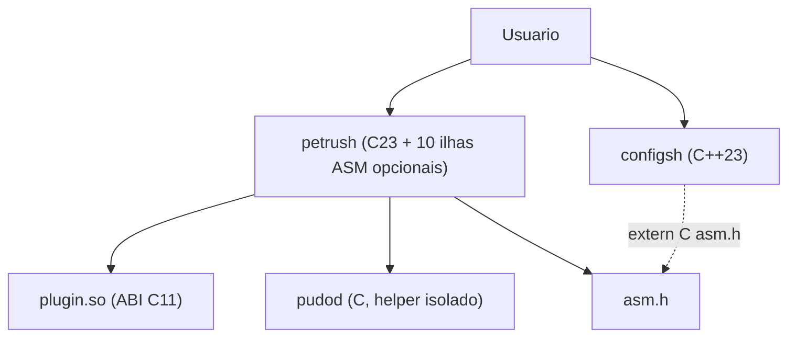

# ADR-001: C23 no parser OSH, C++23 so em configsh, ASM em 10 ilhas, plugins ABI C

**Status:** Accepted
**Data:** 2026-08-23
**Decisores:** lider (petrus); Caetano/CTO (plano tecnico das 10 funcoes e pastas); software-architect (redacao)
**Item TODO.md:** ADR-CXXASM (W23; pre-req ASM-ABI; desbloqueia DOC-ARCH)
**Planos:** [`docs/plano-cxx-asm-plugins.md`](../plano-cxx-asm-plugins.md), [`docs/plano-shell-avancado.md`](../plano-shell-avancado.md)
**Contrato C vivo:** [`include/petrush/asm.h`](../../include/petrush/asm.h) + [`src/asm/abi.inc`](../../src/asm/abi.inc) + [`plugins/abi.h`](../../plugins/abi.h)

Este ADR fecha a **stack tripla** do petrush. Nao implementa `configsh`, nao implementa o loader (`dlopen`), nao acrescenta a 11a ilha ASM. Codigo de produto fica nas fatias CXX-*, PLG-LOAD, ASM-* do `TODO.md`.

---

## Contexto

O nucleo vivo e um shell REPL **C23** (Opcao A, 2026-05-27): parser POSIX em `src/mid/parser.c`, eval/despacho em Mid, processo em Foundation, helper `pudod` fora das 4 camadas. Zero C++ e zero ASM no tree ate a onda W21.

Em 2026-08-23 o lider autorizou um salto de capacidade (porte bigtech): TUI de configuracao, plugins de terceiro, e atomos ASM no nucleo. Sem essa decisao escrita, cada fatia reabre a mesma one-way door:

1. **Linguagem do parser/eval OSH.** Oils (OSH/YSH) e o norte de dialeto (`docs/plano-shell-avancado.md`). Reescrever o parser em C++ agora barateia templates e RAII, e encarece fork/exec, ASan no caminho quente, e ABI estavel para o resto da vida do binario `petrush`.
2. **Onde C++23 pode existir.** A stack default da casa e C++23/Qt. Qt e ncurses foram recusados para este TUI. `configsh` e um binario **separado**, nao uma lib puxada pelo REPL.
3. **Quantas ilhas ASM.** Sem teto, ASM vira god-module (parser, glob, jobs, sysfs, netlink no mesmo `.S`). Com teto, o contrato cabe numa pagina (`asm.h` ja declara **exatamente 10** simbolos).
4. **ABI dos plugins.** Terceiros vao ligar contra um header. C++ na fronteira (name mangling, `std::string`, excecoes atraves de `.so`) e lock-in irreversivel depois do primeiro plugin publico.

Forcas agora:

- Tree ja declara `project(petrush LANGUAGES C CXX ASM)` (ASM-00). ASan/UBSan so em TUs C/C++. `PETRUSH_ASM` default ON so em x86_64.
- Seis ilhas ja tem corpo (MEMEQ, I64, GLOB, PGID, CRC, HASH). Quatro restam (TTY, UTF8, WAI, NET). O contrato nao muda com o corpo.
- Plugins: `plugins/abi.h` ja no tree (PLG-ABI, C11, `PETRUSH_PLUGIN_ABI_MAJOR 1`). Este ADR fixa **C** na fronteira; loader (`dlopen`) continua PLG-LOAD.
- Producao nesta maquina e 4755 continuam proibidos. Testes em Docker Fedora 44.

Sem ADR, DOC-ARCH (prosa↔pastas) e GATE-CXXASM nao tem regra de autoridade para recusar "mais um `.cpp` no parser" ou "mais um `.S` no nucleo".

---

## Decisao

Quatro regras, na mesma porta:

1. **Parser POSIX e eval OSH permanecem C23.** C++23 **nao** entra em `src/mid/parser.c`, nem no runner de script (OSH-0+), nem no caminho fork/exec do REPL `petrush`.
2. **C++23 so no binario `configsh`.** TUI raw (sem ncurses, sem Qt). `petrush` **nao** liga `libstdc++`. Glue C++ extra so se o lider reabrir este ADR.
3. **ASM = 10 ilhas nomeadas**, System V AMD64, GAS via Clang/GCC (`.S`), sem NASM. Conjunto fechado (tabela abaixo). 11o simbolo exige ADR novo.
4. **Plugins: ABI C** (header C11 em `plugins/abi.h`, major=1). Sem `dlopen` no `main` ate PLG-LOAD. SHA-256 do `.so` e recusa world-writable (PLG-NARC / PLG-LOAD). Sem tipos C++ na fronteira.

### D1. C23 no parser / eval OSH

**Owner:** Mid (`src/mid/parser.c` e o eval que o consome).

OSH e o contrato POSIX.1-2017 XCU cap. 2 **mais** o bash cotidiano que o plano avancado admite. A implementacao e C23 (`CMAKE_C_STANDARD 23`). Ilhas ASM no nucleo de eval sao **opcionais** (chamadas C a simbolos de `asm.h`, com fallback C quando `PETRUSH_ASM=OFF`).

MUST NOT:

- Compilar unidades do parser/eval como C++ (`*.cpp` / `extern "C++"` no caminho OSH).
- Introduzir excecoes, RTTI ou STL nesse caminho.
- Fazer o REPL depender de `libstdc++` / `libc++`.

### D2. C++23 so em `configsh`

**Owner:** Front de configuracao (pasta-alvo `src/cxx/`, fatias CXX-00 / CXX-TUI).

`configsh` e processo separado: `--section`, `--dump`, `--check`, XDG. Pode incluir `petrush/asm.h` via `extern "C"` (o header ja tem a guarda). Pode chamar `petrush_tty_mode` e `petrush_utf8_width` quando essas ilhas existirem.

MUST:

- `ldd` do binario `petrush` sem `libstdc++` (prova CXX-00).
- ASan/UBSan no TUs C++ iguais aos C; nunca em `.S`.

MUST NOT:

- Transformar `petrush` num composite C++ (um unico executavel C++ que "tambem" e shell).
- Puxar Qt, ncurses, ou outra TUI toolkit sem ADR novo.

### D3. Dez ilhas ASM (conjunto fechado)

**Owner:** `src/asm/` + declaracoes em `include/petrush/asm.h`. ABI: System V AMD64 PIC (`src/asm/abi.inc`).

| # | Simbolo C | Papel | Fatia |
|---|-----------|--------|-------|
| 1 | `petrush_wai_scan` | Inventario sysfs (`-disk -video -mem -audio -camera -keyboard -usb -pci -battery -thermal -cpu -board`). Sem root. | ASM-WAI |
| 2 | `petrush_netcom_scan` | Scan `-wifi -eth -bt`. `-up`/`-down` fora do simbolo (EPERM sem CAP nesta maquina). | ASM-NET |
| 3 | `petrush_glob_match` | Matcher `*` `?` (substitui C no expand). | ASM-GLOB |
| 4 | `petrush_utf8_width` | Colunas, subset UAX#11. | ASM-UTF8 |
| 5 | `petrush_parse_i64` | Decimal signed 64 sem overflow UB. | ASM-I64 |
| 6 | `petrush_crc32` | CRC-32 IEEE incremental. **Nao** autentica `.so`. | ASM-CRC |
| 7 | `petrush_memeq_ct` | Comparacao tempo constante (XOR\|OR, sem early-out). | ASM-MEMEQ |
| 8 | `petrush_tty_mode` | RAW/COOKED ioctl. | ASM-TTY |
| 9 | `petrush_hash_path` | FNV-1a 64 da string path. | ASM-HASH |
| 10 | `petrush_job_setpgid` | Syscall `setpgid` (0 / `-errno`). | ASM-PGID |

Regras das ilhas:

- Uma ilha = um papel = um `.S` (ou par `.S`+teste). Sem "utils.S" catch-all.
- Fallback C obrigatorio quando `PETRUSH_ASM=OFF` ou arch != x86_64 (configure ja e FATAL se ON fora de x86_64).
- `.note.GNU-stack` via `PETRUSH_NOTE_GNU_STACK`. Sem stack executavel.
- CRC e hash **nao** substituem SHA-256 do loader de plugins.

### D4. Plugins: ABI C, nao C++

**Owner:** `plugins/abi.h` (PLG-ABI) + loader Foundation (PLG-LOAD) + threat model (PLG-NARC).

A fronteira publica com codigo de terceiro e **C11** (`extern "C"` se o autor do plugin escrever C++ do lado dele). Major = 1. O processo `petrush` nao chama `dlopen` ate PLG-LOAD (depois de PLG-NARC).

MUST:

- Allow-list + path XDG / `PETRUSH_PLUGIN_PATH`.
- Recusar `.so` world-writable.
- Integridade por SHA-256 (nao por `petrush_crc32`).

MUST NOT:

- Exportar STL, excecoes, ou class layout no header de plugin.
- Ligar o plugin como C++ ABI do `configsh` (binarios diferentes, contratos diferentes).

Fluxo de dependencia das 4 camadas **nao muda**: Front → Mid → Foundation. ASM e Foundation/plataforma (primitivas). `configsh` e Front. Plugins entram por Foundation (loader), nao pelo parser.

---

## Opcoes consideradas

1. **Tudo C23 (status quo pre-W21)**
   - Pros: um compilador, ASan no 100% do tree, onboarding minimo, zero `libstdc++`.
   - Contras: TUI raw em C e verbosa; plugins de terceiro ainda precisariam de ABI; o lider ja pediu as 10 ilhas e o `configsh`.
2. **C++23 no petrush inteiro, inclusive parser OSH**
   - Pros: RAII, `std::expected`, um so dialecto "moderno".
   - Contras: `libstdc++` no REPL; excecoes vs `fork`; name mangling interno; ASan mais ruidoso; one-way door contra o tree C ja testado (parser, pudo, jobs). Viola a trava explicita do lider.
3. **ASM livre no nucleo (sem teto de 10)**
   - Pros: "otimiza o que doer".
   - Contras: parser em ASM e a classe de bug que ASan nao ve; review vira especialista; portabilidade some; monólito `.S` (proibido pela lei de atomos).
4. **Plugins ABI C++ / COM-like**
   - Pros: API "rica" para autores C++.
   - Contras: lock-in de toolchain; excecoes atraves de `.so`; dual ABI (`configsh` vs plugin); CISO nao consegue threat model estavel.
5. **Escolhida: C23 OSH + C++23 so `configsh` + 10 ilhas ASM + plugins ABI C**
   - Pros: honra a trava do lider; `petrush` continua ldd-simples; ASM reviewavel (10 simbolos); plugin authors em C; `configsh` pode morrer sem levar o shell.
   - Contras: tres linguagens no CMake; fallback C a manter; Docker precisa clang+binutils; C++23 ainda nao tem alvo no tree (CXX-00).

---

## Consequencias

**Positivas:**

- Parser OSH permanece a superficie ASan/UBSan + acutest que ja existe.
- `configsh` e two-way door: apagar o alvo C++ nao quebra o REPL.
- `asm.h` e a pagina de contrato; DOC-ARCH so descreve pastas, nao reabre linguagem.
- Plugin de terceiro nao precisa de C++23 nem de Qt.
- Arch nao-x86_64 continua primeiro cidadão via `PETRUSH_ASM=OFF`.

**Negativas / aceitas como custo:**

- CMake com C + CXX + ASM mesmo antes de existir `configsh` (ja em ASM-00).
- Duplicacao consciente: fallback C ao lado do `.S` (Regra de 3; nao extrair um "asm shim framework").
- Review de `.S` exige SysV AMD64; nao e onboarding de C.
- i18n gettext e Diataxis (I18N-*, DOC-DIA-*) nao sao este ADR; nao atrasam a regra de linguagem.

**Riscos / pontos de atencao:**

- **Creep de ilha 11.** Sintoma: "so mais um syscall wrapper". Mitigacao: recusar no review; abrir ADR-00N.
- **C++ vaza para o REPL.** Sintoma: `target_link_libraries(petrush stdc++)` ou `.cpp` em `src/mid`. Mitigacao: prova `ldd` na fatia CXX-00; gate GATE-CXXASM.
- **Plugin ABI C++ disfarçado.** Sintoma: `abi.h` com `#ifdef __cplusplus` exportando tipos nao-POD. Mitigacao: PLG-ABI testa major=1 e layout C.
- **CRC usado como autenticador de `.so`.** Mitigacao: D3 + D4; SHA-256 no loader.
- **ASan em `.S`.** Ja proibido no CMake (Sanitize so C/C++). Nao reabrir.

---

## Reversibilidade

| Porta | Tipo | Justificativa |
|-------|------|----------------|
| C23 no parser OSH | One-way door | Reescrever o eval depois de OSH-1..9 e jobs e um fork do projeto, nao um refactor. |
| C++23 so `configsh` | Two-way door | Binario separado; remover o alvo nao mexe no REPL. |
| Conjunto das 10 ilhas | Hybrid | Cada ilha tem (ou tera) fallback C; o **teto de 10** e one-way sem ADR novo. |
| Plugins ABI C major=1 | One-way door depois do primeiro `.so` de terceiro | Mudar para C++ ABI quebra autores externos. Major bump e ADR novo. |

---

## Fora deste ADR

- Implementacao de `configsh` (CXX-00, CXX-TUI, TST-CXX).
- Loader `dlopen` / SHA-256 / threat model (PLG-NARC, PLG-LOAD, TST-PLG). Header C11 major=1 ja existe (PLG-ABI).
- Corpos das ilhas 4, 8, 1, 2 ainda ⏳ (UTF8, TTY, WAI, NET).
- Dialeto YSH, pipes estruturados, i18n, Diataxis.
- Setuid 4755 / instalar `/bin/sh` nesta maquina.
- Reescrita da prosa completa de `docs/architecture.md` (DOC-ARCH). Este ADR so exige o **link**.

---

## Proximos passos

1. PLG-NARC + PLG-LOAD: threat model e loader XDG + SHA-256 (header C11 major=1 ja no tree).
2. CXX-00: alvo `configsh` C++23; prova `ldd` do `petrush` sem `libstdc++`.
3. DOC-ARCH: prosa↔pastas da stack tripla, apontando para este ADR.
4. GATE-CXXASM: ctest `asm_` / `configsh` / `plugin_` em Fedora 44. Sem tag neste gate.
