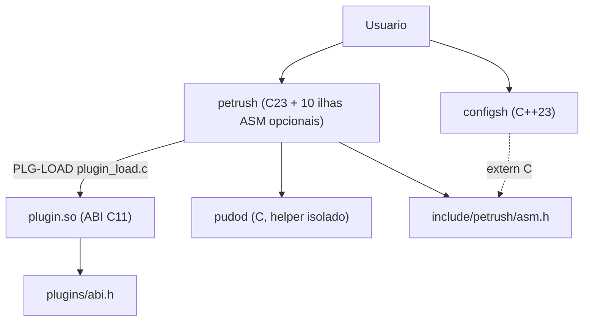

# Arquitetura petrush - Mapeamento de Camadas

**Tipo:** explanation  
**Audience:** desenvolvedor intermediário (interno)  
**Last-reviewed:** 2026-08-23  
**Owner:** technical-writer (DOC-ARCH; base DOC-04 / DOC-01)  
**Versão do produto:** alinhada ao tree atual (pós-v0.5; stack tripla ADR-001)  
**Item TODO.md:** DOC-ARCH (W24)

**Decisão (continuação 2026-07):** Camadas lógicas pragmáticas (Opção 2).

Razão: porte **early** (variante Pipeline-Sprint; marcador `.bigtech-porte`) + anti-over-engineering. A palavra "Solo" em prosa antiga é informal; o piso canônico é early. Evitar churn de mover arquivos agora. Segue os 4 princípios em espírito, sem forçar estrutura física desnecessária para uma ferramenta pequena.

Fecha drift AUD-ARCH F5 / R-I12 e documenta exceções F3/F4 (R-I10 / R-I11). A stack tripla (C23 / C++23 / ASM) e o contrato de plugins estão em [`docs/adr/001-c23-cxx-asm-plugins.md`](adr/001-c23-cxx-asm-plugins.md) (ADR-CXXASM). Esta página descreve **prosa ↔ pastas**; não reabre a decisão de linguagem.

## Mapeamento

| Camada     | Local físico atual | Responsabilidade |
|------------|--------------------|------------------|
| Front      | `src/main.c` (composition root na raiz de `src/`) + `src/front/complete.c` + `src/front/highlight.c` + binário `configsh` em `src/cxx/` | REPL, prompt, I/O, sinais de UI, rc load, history display, tab-complete, highlight; TUI de configuração (processo separado) |
| Mid        | `src/mid/` (lista completa abaixo) | Domínio do shell: parse, expand, builtins/despacho, aliases, dirstack, source, hist expand, prompt string, cliente `pudo` |
| Back       | (ainda thin); ver `src/back/README.md` | Persistência/config futura (history file dedicado, pudo config de longo prazo) |
| Foundation | `src/foundation/env.c` + `process.c` + `job.c` + `rc_trust.c` + `plugin_load.c` + átomos em `src/asm/` | Primitivas do SO: getenv/setenv wrappers, fork/exec/wait/pipeline/redirs, jobs em background (`&`), checagem uid/mode do rc (ARCH-02 / R-I9); ilhas ASM; loader de `.so` (PLG-LOAD: XDG + SHA-256 + allow-list; `pudod` sem `dlopen`) |
| Helper     | `src/pudod/` (binário `pudod` separado) | Elevação opcional / allow-list. **Fora** do quadro de 4 camadas; não inclui `petrush/*` nem linenoise; **nunca** carrega plugin |

### Mid completo (`src/mid/`)

| Unidade | Papel |
|---------|-------|
| `parser.c` | Tokenização / AST de comando e pipeline (**só C23**; ver trava abaixo) |
| `expand.c` | Expansão de palavras (glob via `petrush_glob_match` quando `PETRUSH_ASM=ON`, brace, vars) |
| `dispatcher.c` | Builtins + despacho; bg job (`&`); `petrush_job_setpgid` quando ASM ligado |
| `alias.c` | Aliases de shell |
| `dirstack.c` | Stack de diretórios (`pushd`/`popd`/…) |
| `source.c` | `source` / `.` de scripts e rc |
| `hist_expand.c` | Expansão de history (`!!`, …) via `ui_port` |
| `ui_port.c` | Porta DIP clear + history get/len (ARCH-03) |
| `prompt.c` | Montagem da string de prompt (`PETRUSH_PS1`) |
| `pudo.c` | Cliente unpriv do helper `pudod` |

### Front detalhado

| Unidade | Papel |
|---------|-------|
| `src/main.c` | Loop REPL / composition root (mapeamento lógico = Front). Sem `dlopen`. Sem `libstdc++`. |
| `src/front/complete.c` | Completion + history autosuggest (linenoise) |
| `src/front/highlight.c` | Colorize mínimo (UX-21) |
| `src/cxx/` (`main.cpp`, `config.cpp`, `tui.cpp`) | Binário `configsh` (C++23; CXX-TUI raw ANSI + XDG) |

### Foundation detalhado

| Unidade | Papel |
|---------|-------|
| `env.c` | Wrappers de ambiente |
| `process.c` | `execute_external` / `execute_pipeline` (+ hook de filho; `petrush_job_setpgid` com fallback libc) |
| `job.c` | Tabela de jobs / wait de background (UX-23) |
| `rc_trust.c` | `petrush_rc_stat_ok` (uid/mode do rc; SEC-10). Mid `source.c` inclui `rc_trust.h` (ARCH-02 fechou F2 / R-I9) |
| `src/asm/*.S` | Dez ilhas System V AMD64 (contrato em `include/petrush/asm.h`) |
| `plugins/abi.h` | Contrato C11 dos `.so` de terceiro (PLG-ABI). Loader = `src/foundation/plugin_load.c` (PLG-LOAD) |

## Stack tripla (DOC-ARCH)

Autoridade: ADR-001. Quatro regras fechadas:

1. **Parser POSIX e eval OSH = C23.** C++23 **não** entra em `src/mid/parser.c`, nem no runner de script (OSH-0+), nem no caminho fork/exec do REPL `petrush`.
2. **C++23 só no binário `configsh`** (`src/cxx/`). `petrush` **não** liga `libstdc++`.
3. **ASM = exatamente 10 ilhas** nomeadas em `include/petrush/asm.h`, corpos em `src/asm/`, System V AMD64, GAS via Clang/GCC (`.S`). Sem NASM. Sem ASan/UBSan nos TUs `.S`.
4. **Plugins = ABI C11** em `plugins/abi.h` (major=1). Sem tipos C++ na fronteira. `dlopen` só em `plugin_load.c` (não no `main`; nunca no `pudod`).

### Prosa ↔ pastas (linguagens)

| Superfície | Linguagem | Pasta / artefato | Binário |
|------------|-----------|------------------|---------|
| Parser / eval OSH / REPL | C23 | `src/mid/parser.c`, restante Mid/Front/Foundation em `.c` | `petrush` |
| TUI de configuração | C++23 (`-fno-exceptions -fno-rtti`) | `src/cxx/main.cpp` (+ TUI futura na mesma pasta) | `configsh` |
| 10 ilhas nomeadas | ASM System V AMD64 (GAS/Clang) | `src/asm/*.S` + `src/asm/abi.inc` + `include/petrush/asm.h` | ligadas em `petrush` e, quando útil, em `configsh` se `PETRUSH_ASM=ON` |
| Plugins de terceiro | ABI C11 | `plugins/abi.h` + `plugin_load.c` (XDG/`PETRUSH_PLUGIN_PATH`, allow-list SHA-256, recusa `o+w`) | `.so` externo; threat model em `docs/security/plugins-threat.md` |
| Helper de elevação | C | `src/pudod/` | `pudod` (sem plugin, sem linenoise, sem `petrush/*`) |

### Trava: sem C++ no parser

MUST NOT (reprovado em review / GATE-CXXASM):

- Compilar `src/mid/parser.c` (ou o eval OSH que o consome) como C++ (`*.cpp`, `extern "C++"` nesse caminho).
- Introduzir exceções, RTTI ou STL no REPL.
- `target_link_libraries(petrush … stdc++)` ou equivalente.
- Colocar `.cpp` sob `src/mid/`, `src/foundation/` ou `src/front/` (exceto o alvo separado `src/cxx/` → `configsh`).

Prova atual (CXX-00): `tests/smoke/cxx00-ldd.sh` exige `libstdc++` **ausente** em `petrush` e **presente** em `configsh`.

### `configsh` (C++23)

| Item | Valor |
|------|-------|
| Pasta | `src/cxx/` |
| Entrada | `src/cxx/main.cpp` |
| Flags | C++23, `-fno-exceptions`, `-fno-rtti` |
| Toolkit UI | TUI raw ANSI (sem ncurses, sem Qt) = CXX-TUI |
| Flags CLI | `--section`, `--dump`, `--check`, `--help` |
| Config XDG | `$PETRUSH_CONFIG` ou `$XDG_CONFIG_HOME/petrush/config.ini` ou `~/.config/petrush/config.ini` |
| Secoes INI | `prompt`, `aliases`, `env`, `history`, `general` |
| ASM permitido | `petrush_tty_mode`, `petrush_utf8_width` via `petrush/asm.h` (`extern "C"`) |
| Relação com plugins | **não** partilha a ABI de `plugins/abi.h`; binário distinto do REPL |
| Smoke | `tests/smoke/cxx-tui.sh` / target `cxx_tui` |

### Dez ilhas ASM (conjunto fechado)

Contrato C: [`include/petrush/asm.h`](../include/petrush/asm.h). Macros PIC: [`src/asm/abi.inc`](../src/asm/abi.inc). Inventário curto: [`src/asm/README.md`](../src/asm/README.md).

| # | Símbolo C | Ficheiro `.S` | Papel | Fatia | Estado no tree |
|---|-----------|---------------|--------|-------|----------------|
| 1 | `petrush_wai_scan` | (ainda sem corpo; só decl. em `asm.h`) | Inventário sysfs (`-disk -video -mem` + audio/camera/keyboard/usb/pci/battery/thermal/cpu/board). Sem root. | ASM-WAI | declaração |
| 2 | `petrush_netcom_scan` | `src/asm/netcom_scan.S` | Scan `-wifi -eth -bt` (sysfs+netlink GET). `-up`/`-down` em C (EPERM sem CAP). | ASM-NET | corpo + CMake |
| 3 | `petrush_glob_match` | `src/asm/glob_match.S` | Matcher `*` `?` (expand) | ASM-GLOB | corpo + CMake |
| 4 | `petrush_utf8_width` | `src/asm/utf8_width.S` | Colunas, subset UAX#11 | ASM-UTF8 | corpo + CMake |
| 5 | `petrush_parse_i64` | `src/asm/parse_i64.S` | Decimal signed 64 sem overflow UB | ASM-I64 | corpo + CMake |
| 6 | `petrush_crc32` | `src/asm/crc32.S` | CRC-32 IEEE incremental. **Não** autentica `.so`. | ASM-CRC | corpo + CMake |
| 7 | `petrush_memeq_ct` | `src/asm/memeq_ct.S` | Comparação tempo constante (XOR\|OR, sem early-out) | ASM-MEMEQ | corpo + CMake |
| 8 | `petrush_tty_mode` | `src/asm/tty_mode.S` | RAW/COOKED ioctl | ASM-TTY | corpo + CMake |
| 9 | `petrush_hash_path` | `src/asm/hash_path.S` | FNV-1a 64 da string path | ASM-HASH | corpo + CMake |
| 10 | `petrush_job_setpgid` | `src/asm/job_setpgid.S` | Syscall `setpgid` (0 / `-errno`) | ASM-PGID | corpo + CMake |

Extras de toolchain (não contam como 11ª ilha):

- `src/asm/empty.S`: stub de link (ASM-00).
- `PETRUSH_ASM`: default ON só em x86_64; ON noutro arch = FATAL no configure. Fallback C quando OFF (ex.: `expand.c` / `process.c` / `dispatcher.c`).

11º símbolo exige ADR novo. Sem `utils.S` catch-all.

### Plugins (ABI C)

| Item | Valor |
|------|-------|
| Header | [`plugins/abi.h`](../plugins/abi.h) (C11, `PETRUSH_PLUGIN_ABI_MAJOR 1`, minor 0) |
| Entry points | `petrush_plugin_query` / `init` / `cmd` / `fini` (+ vtable opcional `petrush_plugin_abi`) |
| Loader | Foundation `plugin_load.c` (PLG-LOAD); **zero** `dlopen` no `main` e no `pudod` |
| Paths futuros | XDG + `PETRUSH_PLUGIN_PATH` |
| Controles (PLG-NARC) | allow-list, recusa world-writable, integridade **SHA-256** (não CRC/FNV) |
| Threat model | [`docs/security/plugins-threat.md`](security/plugins-threat.md) |
| `pudod` | **não** carrega plugin |



Fluxo das 4 camadas **não muda**: Front → Mid → Foundation. ASM é Foundation/plataforma. `configsh` é Front (processo separado). Plugins entram por Foundation (loader), não pelo parser.

## Build

Tudo listado explicitamente em `CMakeLists.txt`:

- `project(petrush LANGUAGES C CXX ASM)` (ASM-00 + CXX-00).
- Alvo `petrush`: Mid/Front/Foundation em C + `${PETRUSH_ASM_SOURCES}` quando `PETRUSH_ASM=ON`.
- Alvo `configsh`: `src/cxx/{main,config,tui}.cpp` (+ ilhas tty/utf8 se ASM ligado).
- Alvo `pudod`: separado, sem sanitize (incompatível com setuid futuro).
- ASan/UBSan só em TUs C/C++; nunca em `.S`.
- Gates isolados: `tests/smoke/asm00-toolchain.sh`, `asm-abi-header.sh`, `cxx00-ldd.sh`, `plg-abi-header.sh`.

## Estado físico das pastas

- `src/front/`: código real (`complete.c`, `highlight.c`). `main.c` permanece na raiz de `src/` por simplicidade (porte early).
- `src/cxx/`: `configsh` C++23 (CXX-TUI: `--dump`/`--check`/`--section`, XDG, TUI raw).
- `src/mid/`: núcleo ativo do shell (tabela acima). **Só `.c`.**
- `src/foundation/`: `env.c`, `process.c`, `job.c`, `rc_trust.c`.
- `src/asm/`: ilhas System V AMD64 + `abi.inc` + `empty.S`.
- `src/back/`: placeholder (README explica intenção).
- `src/pudod/`: binário helper isolado (`pudod.c` + allow/resolve/open). Ver `docs/security/pudod-install.md`. Setuid **não** endossado nesta passada.
- `plugins/`: só `abi.h` nesta fase (sem `.so` de exemplo obrigatório no REPL).
- `include/petrush/asm.h`: as 10 declarações C.

## Exceções de fronteira aceitas no early

CONTRACT §5 e o checklist AUD-ARCH pedem que só Foundation/platform chame libc de processo, e que Foundation não conheça AST de aplicação. No porte early estas duas exceções estão **documentadas e aceitas** (não são bugs silenciosos):

### F3 / R-I10 - Mid chama `fork` / `exec*` (pudo + jobs)

| Onde | Por quê |
|------|---------|
| `src/mid/dispatcher.c` (`dispatch_pipeline_background`: `fork`, `open("/dev/null")`) | Job `&` (UX-23) fica **fora** de `execute_external` / `execute_pipeline` de propósito (não empurrar bg para o caminho síncrono). |
| `src/mid/pudo.c` (`execve` / caminho do helper) | Cliente unpriv dispara o binário `pudod` após sanitização; desenho de segurança (helper separado). |

Mitigação futura opcional: `petrush_spawn_background()` em Foundation. Não bloqueia early.

### F4 / R-I11 - `process.h` inclui `parser.h`

`include/petrush/process.h` inclui `petrush/parser.h` para tipar `petrush_cmd_t` / pipeline (DTO do shell). Foundation **não** inclui `dispatcher.h` (comentário no header). Aceito no early; alternativa futura = extrair `petrush/cmd.h` neutro sem lógica Mid.

### Outras dívidas de fronteira (não fechadas por DOC-04)

| ID | Tema | Estado |
|----|------|--------|
| F1 / R-I8 | Mid importa linenoise (`dispatcher` clear; `hist_expand`) | **Fechado** por ARCH-03 (`ui_port` DIP; adapter em `complete.c`) |
| F2 / R-I9 | `rc_trust` físico Front, usado pelo Mid | **Fechado** por ARCH-02 (`src/foundation/rc_trust.c`) |

## Direção de includes (alvo early)

```
Front (main, complete, highlight) + configsh (src/cxx, processo separado)
  → Mid → Foundation (env, process, job, rc_trust, asm.h)
Back: thin / placeholder
plugins: abi.h (C11) → plugin_load.c (PLG-LOAD; SHA-256; pudod sem .so)
pudod: headers locais apenas (0 petrush/*, 0 linenoise, 0 plugins)
```

Vendor linenoise: path canônico de UI = Front. Mid acessa clear/history só via `petrush/ui_port.h` (ARCH-03 / F1 fechado).

## Futuro

Quando o projeto crescer ou após revisão de porte (Cosimo), podemos materializar as camadas físicas movendo arquivos (ex.: `main.c` → `src/front/`) e atualizando includes/CMake. `rc_trust.c` já está em Foundation (ARCH-02). Até lá, o mapeamento lógico acima é a fonte de verdade.

Próximas fatias da stack tripla (não reabrem ADR-001): ASM-NET, DOC-DIA-*, TST-CXX, TST-ASM, TST-PLG, GATE-CXXASM.

Ver também:

- [`docs/adr/001-c23-cxx-asm-plugins.md`](adr/001-c23-cxx-asm-plugins.md) (ADR-CXXASM / ADR-001)
- [`docs/plano-cxx-asm-plugins.md`](plano-cxx-asm-plugins.md)
- [`docs/security/plugins-threat.md`](security/plugins-threat.md) (PLG-NARC)
- `CLAUDE.md` (regras do projeto)
- `.bigtech-porte` (porte=early, variante=Pipeline-Sprint)
- `src/front/README.md` / `src/back/README.md` / `src/pudod/README.md` / `src/asm/README.md` / `src/cxx/README.md`
- `docs/design/pudo.md` e `docs/security/`
- `docs/auditoria/aud-arch.md` (F1-F8)
- `TODO.md` (DOC-ARCH, ADR-CXXASM, ASM-*, CXX-*, PLG-*)

## Notas de qualidade

- `petrush`: 0 deps runtime além de libc + linenoise (embutido; atribuição em `NOTICE`) + ASM opcional. Sem `libstdc++` (ADR-CXXASM / CXX-00; prova `tests/smoke/cxx00-ldd.sh`).
- `configsh` (CXX-00/CXX-TUI): C++23 (`-fno-exceptions -fno-rtti`), binário separado; TUI raw ANSI; `--dump`/`--check`/`--section`; XDG.
- Hardening + ASan/UBSan (só C/C++) + cppcheck + clang-tidy tuned.
- TDD com acutest nas camadas mid/foundation (inclui `tests/test_rc_trust.c`; Front: `tests/test_complete.c` / `tests/test_highlight.c`; ASM: `tests/asm/test_*.c` sob `ctest -R asm_`).
- Produção / `4755` nesta máquina: fora de escopo desta stack.
