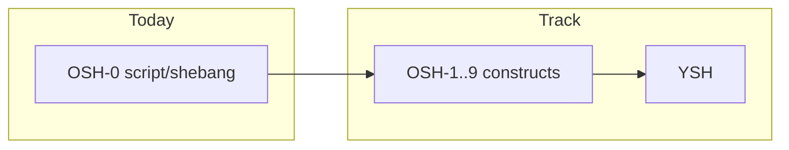

# OSH-0 is not full POSIX

**Diátaxis type:** explanation  
**Audience:** leader, contributors, readers who saw the word "POSIX" in the plan  
**Item:** DOC-DIA-EN · **Owner:** technical-writer · **Last-reviewed:** 2026-08-23

## Context

The petrush plan speaks of two Oils-style dialects: **OSH** (bytes, near-classic shell contract) and **YSH** (richer language). The **target** bar for OSH is IEEE 1003.1-2017 XCU chapter 2 **plus** everyday bash 4/5. That is the **north star**, not the state of the binary today.

The first code slice on that track is called **OSH-0**: shebang + `petrush file` + exit status. It exists to unlock scripts and CI without waiting for the full parser.

## Mental model

- **Full POSIX** would be a conformance claim (suite, `--posix` options, obscure corners). The project does **not** make that claim.
- **OSH-0** is a narrow corridor: regular file, lines, existing builtins/PATH, status.
- Documenting "petrush = /bin/sh POSIX 100%" would be false and dangerous (users and agents would treat gaps as bugs).

## Trade-offs

| Choice | Pros | Accepted cons |
|--------|------|---------------|
| Start with shebang | Unlocks smoke, Docker, minimal script authorship | No `$1`, no `if` |
| Name the slice OSH-0 | Makes OSH-1+ obvious | Readers of the name "OSH" alone may think it is already Oils |
| Keep C23 in eval | Stable ABI; C++ only in `configsh` | Rich TUI does not live in the same process |

## When to apply / not apply

- Use OSH-0 when you need a short script, reliable status, and a shebang.
- Do not use OSH-0 as proof of POSIX portability for a complex bash script.
- Do not write docs or READMEs that say "POSIX conformant" without the matching track and tests.

## References

- Plan: [`docs/plano-shell-avancado.md`](../../../plano-shell-avancado.md)
- Reference: [OSH-0 / shebang](../reference/osh0-shebang.md)
- Code: `src/main.c` (`argc >= 2` branch), `src/mid/source.c` (`petrush_run_script`)
