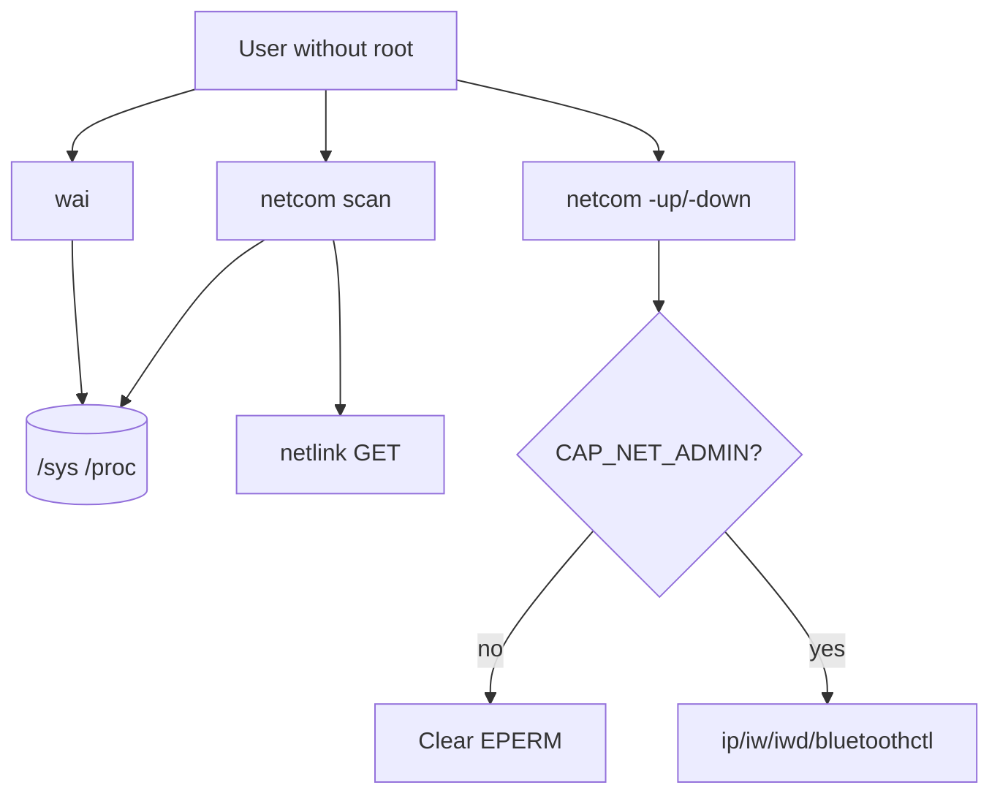

# Why `wai` and `netcom` read sysfs

**Diátaxis type:** explanation  
**Audience:** contributors and users curious about privilege  
**Item:** DOC-DIA-EN · **Owner:** technical-writer · **Last-reviewed:** 2026-08-23

## Context

Two builtins expose machine inventory: `wai` (hardware) and `netcom` (network). Both start as ASM islands in the core, with sensitive I/O in C (for ASan). The design avoids root and avoids setuid (`4755` is forbidden in this project).

## Mental model

- **Reading** inventory: sysfs (and netlink GET in `netcom`) is enough on most Linux desktops. It does not elevate.
- **Changing** link: needs a capability. Without it, immediate error. There is no silent path.
- **Privacy:** `wai` filters `serial`/`uuid` in the name so stable identifiers are not leaked by accident.

## Trade-offs

| Decision | Why | Cost |
|----------|-----|------|
| Sysfs instead of heavy udev libs | Few deps; testable with overlay | Sysfs layout varies across kernels |
| ASM at the entry, C for I/O | Small island + ASan on buffer work | Two files per feature |
| `-up` outside the scan symbol | Scan never "almost elevates" | Two APIs for the user to learn |
| No libcap | Reads `CapEff` in `/proc/self/status` | Less portable outside Linux |

## When to apply / not apply

- Use `wai`/`netcom` scan for everyday diagnostics without sudo.
- Do not expect identical inventory in minimal containers without sysfs.
- Do not use `netcom -up` as a NetworkManager stand-in in production without the leader authorizing the privilege model.

## References

- Reference: [`wai`](../reference/wai.md), [`netcom`](../reference/netcom.md)
- ADR-001 and `include/petrush/asm.h`
