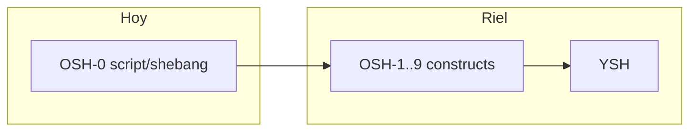

# OSH-0 no es POSIX completo

**Tipo Diátaxis:** explanation  
**Audiencia:** líder, contribuidores, lectores que vieron la palabra "POSIX" en el plan  
**Item:** DOC-DIA-ES · **Owner:** technical-writer · **Last-reviewed:** 2026-08-23

## Contexto

El plan del petrush habla de dos dialectos al estilo Oils: **OSH** (bytes, contrato cercano a shell clásico) y **YSH** (lenguaje rico). La barra **objetivo** del OSH es IEEE 1003.1-2017 XCU capítulo 2 **más** el bash 4/5 cotidiano. Eso es el **norte**, no el estado del binario hoy.

La primera rebanada de código de ese riel se llama **OSH-0**: shebang + `petrush archivo` + exit status. Existe para destrabar scripts y CI sin esperar el parser completo.

## Modelo mental

- **POSIX completo** sería una afirmación de conformidad (suite, opciones `--posix`, rincones oscuros). El proyecto **no** hace esa afirmación.
- **OSH-0** es un corredor estrecho: archivo regular, líneas, builtins/PATH ya existentes, status.
- Documentar "petrush = /bin/sh POSIX 100%" sería falso y peligroso (usuarios y agentes tratarían los huecos como bugs).

## Trade-offs

| Elección | Pros | Contras aceptados |
|----------|------|-------------------|
| Empezar por el shebang | Desbloquea smoke, Docker, autoría de scripts mínimos | Sin `$1`, sin `if` |
| Nombrar la rebanada OSH-0 | Deja claro que hay OSH-1+ | Quien lee solo el nombre "OSH" puede creer que ya es Oils |
| Mantener C23 en el eval | ABI estable; C++ solo en el `configsh` | La TUI rica no vive en el mismo proceso |

## Cuándo aplicar / no aplicar

- Usa OSH-0 cuando necesites un script corto, status fiable y shebang.
- No uses OSH-0 como prueba de portabilidad POSIX de un script bash complejo.
- No escribas docs o READMEs que digan "conforme a POSIX" sin el riel y las pruebas correspondientes.

## Referencias

- Plan: [`docs/plano-shell-avancado.md`](../../../plano-shell-avancado.md)
- Reference: [OSH-0 / shebang](../reference/osh0-shebang.md)
- Código: `src/main.c` (rama `argc >= 2`), `src/mid/source.c` (`petrush_run_script`)
