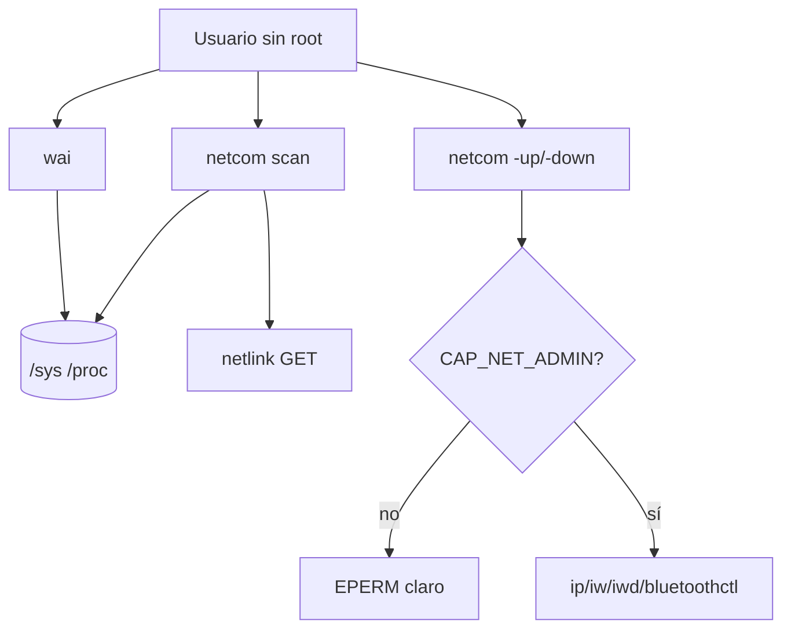

# Por qué `wai` y `netcom` leen sysfs

**Tipo Diátaxis:** explanation  
**Audiencia:** contribuidores y usuarios curiosos sobre privilegio  
**Item:** DOC-DIA-ES · **Owner:** technical-writer · **Last-reviewed:** 2026-08-23

## Contexto

Dos builtins exponen inventario de la máquina: `wai` (hardware) y `netcom` (red). Ambos nacen como islas ASM en el núcleo, con I/O sensible en C (para ASan). El diseño evita root y evita setuid (`4755` prohibido en este proyecto).

## Modelo mental

- **Leer** inventario: sysfs (y netlink GET en el `netcom`) basta en la mayor parte de los desktops Linux. No eleva.
- **Cambiar** link: necesita capability. Sin ella, error inmediato. No hay camino silencioso.
- **Privacidad:** `wai` filtra `serial`/`uuid` en el nombre para no esparcir identificadores estables por accidente.

## Trade-offs

| Decisión | Por qué | Costo |
|----------|---------|-------|
| Sysfs en vez de libs udev pesadas | Pocas deps; testeable con overlay | El layout de sysfs varía entre kernels |
| ASM en la entrada, C en el I/O | Isla pequeña + ASan en lo que toca buffers | Dos archivos por feature |
| `-up` fuera del símbolo de scan | El scan nunca "casi eleva" | Dos APIs para que el usuario aprenda |
| Sin libcap | Lee `CapEff` en `/proc/self/status` | Menos portable fuera de Linux |

## Cuándo aplicar / no aplicar

- Usa `wai`/`netcom` scan en diagnóstico cotidiano sin sudo.
- No esperes inventario idéntico en containers mínimos sin sysfs.
- No uses `netcom -up` como sustituto de NetworkManager en producción sin que el líder autorice el modelo de privilegio.

## Referencias

- Reference: [`wai`](../reference/wai.md), [`netcom`](../reference/netcom.md)
- ADR-001 e `include/petrush/asm.h`
