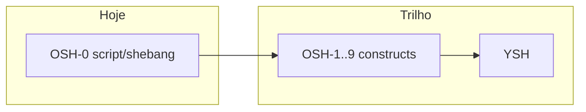

# OSH-0 não é POSIX completo

**Tipo Diátaxis:** explanation  
**Audiência:** líder, contribuidores, leitores que viram a palavra "POSIX" no plano  
**Item:** DOC-DIA-PT · **Owner:** technical-writer · **Last-reviewed:** 2026-08-23

## Contexto

O plano do petrush fala em dois dialectos ao estilo Oils: **OSH** (bytes, contrato próximo de shell clássico) e **YSH** (linguagem rica). A barra **alvo** do OSH é IEEE 1003.1-2017 XCU capítulo 2 **mais** o bash 4/5 quotidiano. Isso é o **norte**, não o estado do binário hoje.

A primeira fatia de código desse trilho chama-se **OSH-0**: shebang + `petrush arquivo` + exit status. Existe para destravar scripts e CI sem esperar o parser completo.

## Modelo mental

- **POSIX completo** seria uma afirmação de conformidade (suíte, opções `--posix`, cantos obscuros). O projeto **não** faz essa afirmação.
- **OSH-0** é um corredor estreito: ficheiro regular, linhas, builtins/PATH já existentes, status.
- Documentar "petrush = /bin/sh POSIX 100%" seria falso e perigoso (utilizadores e agentes tratariam gaps como bugs).

## Trade-offs

| Escolha | Prós | Contras aceites |
|---------|------|-----------------|
| Começar pelo shebang | Desbloqueia smoke, Docker, autoria de scripts mínimos | Sem `$1`, sem `if` |
| Nomear a fatia OSH-0 | Deixa claro que há OSH-1+ | Quem lê só o nome "OSH" pode achar que já é Oils |
| Manter C23 no eval | ABI estável; C++ só no `configsh` | TUI rica não vive no mesmo processo |

## Quando aplicar / não aplicar

- Use OSH-0 quando precisar de um script curto, status fiável e shebang.
- Não use OSH-0 como prova de portabilidade POSIX de um script bash complexo.
- Não escreva docs ou READMEs que digam "conforme POSIX" sem o trilho e os testes correspondentes.

## Referências

- Plano: [`docs/plano-shell-avancado.md`](../../../plano-shell-avancado.md)
- Reference: [OSH-0 / shebang](../reference/osh0-shebang.md)
- Código: `src/main.c` (ramo `argc >= 2`), `src/mid/source.c` (`petrush_run_script`)
