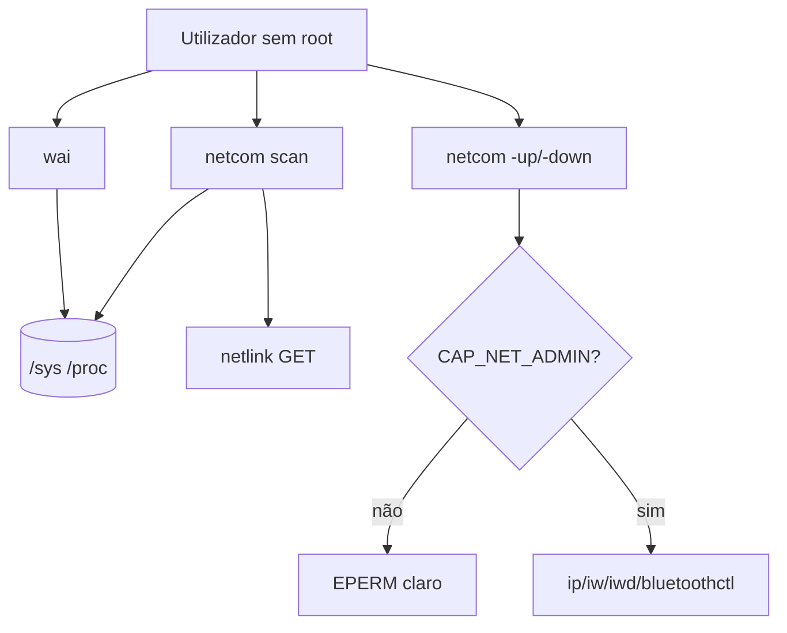

# Por que `wai` e `netcom` leem sysfs

**Tipo Diátaxis:** explanation  
**Audiência:** contribuidores e utilizadores curiosos sobre privilégio  
**Item:** DOC-DIA-PT · **Owner:** technical-writer · **Last-reviewed:** 2026-08-23

## Contexto

Dois builtins expõem inventário da máquina: `wai` (hardware) e `netcom` (rede). Ambos nascem como ilhas ASM no núcleo, com I/O sensível em C (para ASan). O desenho evita root e evita setuid (`4755` proibido neste projeto).

## Modelo mental

- **Ler** inventário: sysfs (e netlink GET no `netcom`) é suficiente na maior parte dos desktops Linux. Não eleva.
- **Mudar** link: precisa capability. Sem ela, erro imediato. Não há caminho silencioso.
- **Privacidade:** `wai` filtra `serial`/`uuid` no nome para não espalhar identificadores estáveis por acidente.

## Trade-offs

| Decisão | Por quê | Custo |
|---------|---------|-------|
| Sysfs em vez de libs udev pesadas | Poucas deps; testável com overlay | Layout de sysfs varia entre kernels |
| ASM na entrada, C no I/O | Ilha pequena + ASan no que toca buffers | Dois ficheiros por feature |
| `-up` fora do símbolo de scan | Scan nunca "quase eleva" | Duas APIs para o utilizador aprender |
| Sem libcap | Lê `CapEff` em `/proc/self/status` | Menos portável fora de Linux |

## Quando aplicar / não aplicar

- Use `wai`/`netcom` scan em diagnóstico quotidiano sem sudo.
- Não espere inventário idêntico em containers mínimos sem sysfs.
- Não use `netcom -up` como substituto de NetworkManager em produção sem o líder autorizar o modelo de privilégio.

## Referências

- Reference: [`wai`](../reference/wai.md), [`netcom`](../reference/netcom.md)
- ADR-001 e `include/petrush/asm.h`
